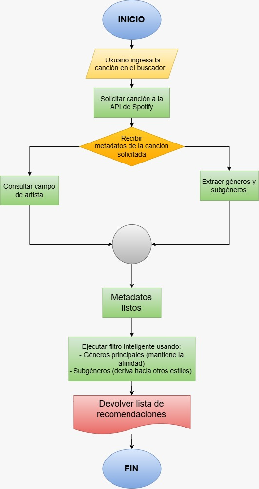

# Audy Project Documentation

## Introduction

Audy is an online web tool designed to help users find and discover new music based on songs and artists they listen to and know they enjoy.

The user will be able to add a song as a reference, and the system will use that song to generate different suggestions for songs and artists that will suit similar tastes. Some songs will have characteristics akin to the original song, whether that is style, genre, artist or other relevant factors.

The system, however, will not be limited to only finding songs that sound alike. The inputted song will also function as a reference point to explore connections between genres, subgenres, musical styles and more relationships that will expand and diversify the user's musical catalog.

In this way, the recommendations made by the system will start from music relatively close to the original and slowly develop to include other music that might interest the user.

The primary objective is that the user can find artists or genres that they might not have listened to before and may not be able to find with a traditional search.

Unlike conventional systems that will give generic, obsolete, or repetitive suggestions, our system prioritizes the exploration and discovery of new and enjoyable music.

The system will try to avoid recommendations that are too mainstream or based solely on popularity, without reaching the point of suggesting artists with a nonexistent listening audience.

Therefore, the purpose of AUDY will be to ultimately help the user discover songs that match their affinity the most in a progressive and effective manner.

## Primary Objective

Develop a tool for music discovery that allows usage of a song known and liked by the user as a reference for obtaining recommendations for not just similar songs, but also genres, subgenres, artists and other suggestions that the user might enjoy.

This is done with the main objective of providing the user with a way to explore the music space in a way that they might not otherwise be able to.

## Functional Requirements

### RF-01: Search for a song
The system must allow the user to search up the song via a search browser.

### RF-02: Send API request
The system must send an API request to Spotify’s API based on the song provided by the user.

### RF-03: Receive song metadata
The system must receive the metadata of the requested song.

### RF-04: Utilize artist data
The system must utilize the "Artist" data for its operations.

### RF-05: Acquire genres and subgenres
The system must acquire the genres and subgenres linked to the artist of the song.

### RF-06: Apply popularity filter
The system must utilize the "popularity" data of the solicited song to utilize an adapted popularity filter.

### RF-07: Filter and find similar songs
The system must filter and find similar songs utilizing the parameters outlined, these being genre, subgenre, artist and popularity filter.

### RF-08: Return recommendations
The system must return the list of songs found to the user as a recommendation.

## Preliminary System Flow

The following diagram represents a preliminary version of how the system is expected to operate. The specific details of the process may change during the development phase.

## Preliminary Abstraction of Possible Classes

The following classes represent a preliminary abstraction of the main objects and components that could be part of the system. Since the project is currently in an initial design phase, their attributes, methods and relationships may change during development.

Most musical data will be obtained through external services, such as the Spotify Web API or LastFM API. The structures received from these services could be transformed into objects within our own system, allowing the application to work only with the information required for its operation.

### Class: Track

**Responsibility:**  
Represents a song within the system.

The class will store only the information about a song that is relevant for search and discovery functions.

**Attributes:**

- id
- title
- artist
- popularity
- previewUrl

**Methods:**

- getId()
- getTitle()
- getArtist()
- getPopularity()
- getCoverImage()
- getPreviewUrl()

### Class: Artist

**Responsibility:**  
Represents an artist and the musical information associated with them that can be used during the discovery process.

**Attributes:**

- id
- name
- genres

**Methods:**

- getId()
- getName()
- getGenres()

### Class: SpotifyAPIClient

**Responsibility:**  
Manages communication between the application and the Spotify Web API.

This class acts as an intermediary between the services provided by Spotify and the rest of the system.

**Methods:**

- authenticate()
- searchTrack()
- getArtistInformation()
- getArtistGenres()

Depending on the evolution of the project, additional methods may be added or modified according to the information that can actually be obtained through external APIs.

### Class: DiscoveryEngine

**Responsibility:**  
Manages the main logic of the music discovery process.

This class will use the information obtained from the reference song and other available sources to generate recommendations. The process may include both songs similar to the reference and songs obtained through the exploration of genres, subgenres, artists and other musical relationships.

**Methods:**

- generateRecommendations()
- generateDiscoveryPath()

Its function will not be limited to finding similar songs, but rather determining possible exploration paths that allow the user's musical catalog to progressively expand.

The Spotify Web API will initially be considered a source of musical information. The discovery and recommendation logic of the project will remain separated from communication with that API through SpotifyAPIClient.